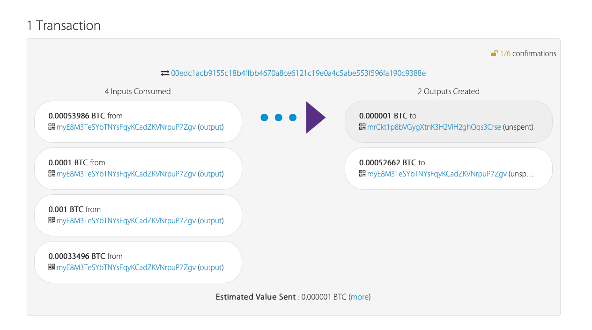

## Blockchain with Python Homework - Steffen Westerburger ##
## Multi-Blockchain Wallet in Python ##

**What does the HD wallet do?**

According to Investopedia the HD wallet is a hierarchical deterministic wallet, which enables the used to automatically generate a hierarchical tree-like structure of private and public addresses (keys). This makes the process very easy, and solves the problem of users having the manually generate keys on their own. 

**How is the wallet built?**

*needed dependencies*

* PHP
* hd-wallet-derive tool  (see readme of this tool)
* bit library in Python
* web3.py Python Ethereum library

To build the wallet we use the command line tool together with `hd-wallet-derive`. There is no direct tool in Python yet, so we need to integrate this script in the backend of our Python. 

After installing the tools/dependencies, you can make a connection with the HD wallet derive in python, using the following command. This will derive the wallet:

`def derive_wallets (mnemonic, coin, num):`
    
    `command = f'./derive -g --mnemonic="{mnemonic}" --coin="{coin}" --numderive="{num}" --cols=index,path,address,privkey,pubkey,pubkeyhash,xprv,xpub --format=json'

    p = subprocess.Popen(command, stdout=subprocess.PIPE, shell=True)
    (output, err) = p.communicate()
    
    keys = json.loads(output)
    
    return keys

**A BTC Testnet Transaction**

You can run these transactions out of the notebook, or out of the terminal. For the terminal, one can use the following command. Make sure you open the terminal in the ethereum environment and navigate to the wallet folder. Then start the python prompt by typing `$python`

The same commands (with the exception of the first import line 'from wallet import, this wont be necessary) would do the same job.

*commands*

from wallet import *

btc_key = priv_key_account(BTCTEST, derive_wallets(mnemonic2, BTCTEST, 3)[0][‘privkey'])

send_tx(BTCTEST, btc_key, derive_wallets(mnemonic2, BTCTEST, 3)[1][‘address'], 0.001)

**A Ethereum Transaction**

*commands*

from wallet import *

eth_key = priv_key_account(ETH, derive_wallets(mnemonic, ETH, 3)[0][‘privkey'])

send_tx(ETH, eth_key, derive_wallets(mnemonic, ETH, 3)[1][‘address'], 20)

